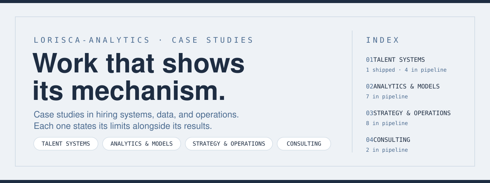

The through-line across everything here: the obvious metric points one way, the mechanism underneath points the other.

---

## Shipped

<table>
<tr>
<td width="60%" valign="top">

`TALENT SYSTEMS`

### Which Employers Reliably Sponsor H-1B Business Roles

SQL analysis of 3.47M H-1B filings (2020–2023). The business-role wage premium survives on medians — then breaks honestly when IT managers are excluded.

**3.47M filings · 8 queries**

[Repo](https://github.com/lorisca-analytics/h1b-sponsorship-sql-analysis) · [All case studies](https://lorisca-analytics.github.io)

</td>
<td width="40%" valign="top">

</td>
</tr>
</table>

---

## Featured walkthrough

<table>
<tr>
<td width="60%" valign="top">

`ANALYTICS & MODELS` `PYTHON`

### Reading the Massachusetts labor market through H-1B filings

I'm on an F-1 visa. Finding the right role isn't the whole job search — I need an employer who'll go the full distance: OPT → STEM OPT → H-1B. So I read 137,866 Massachusetts H-1B filings (FY2020–2024) and asked: do the business roles I'd apply to get sponsored as often, and pay as well, as the data-and-analytics roles my visa plan leans on?

**The answer:** 13,672 vs 14,035 filings. $105,000 vs $104,000 median pay — statistically the same. 0% vs 100% STEM — the H-1B clock is tighter on the business side.

**The correction:** an earlier version reported $115,000 for the business median — 2,583 IT managers had slipped into the business group through their occupation code. Re-ran without them: $105,000. The notebook shows exactly what changed.

**The walkthrough:**
1. **Load** the Massachusetts disclosure file — 137,866 rows.
2. **Filter** to certified H-1B filings — 123,497 rows.
3. **Normalize** every wage to annual; report medians (typo'd pay units make averages meaningless).
4. **Group** by government occupation codes, not keyword matching — and pull the IT managers back out.
5. **Compare** with one groupby, plus bootstrap confidence intervals on the medians.

[Repo](https://github.com/lorisca-analytics/massachusetts-h1b-analysis) · [10-min video walkthrough](https://www.youtube.com/watch?v=SEite--Lkh4) · [Notebook](https://github.com/lorisca-analytics/massachusetts-h1b-analysis/blob/main/notebooks/h1b_ma_analysis.ipynb)

</td>
<td width="40%" valign="top">

</td>
</tr>
</table>

---

## The lanes

<table>
<tr>
<td width="50%" valign="top">

`TALENT SYSTEMS`

Hiring, retention, and workforce data.

**1 shipped** · 4 in the pipeline

</td>
<td width="50%" valign="top">

`ANALYTICS & MODELS`

SQL, machine learning, and BI — built to support one decision, with limits stated.

**2 shipped** · 6 in the pipeline

</td>
</tr>
<tr>
<td width="50%" valign="top">

`STRATEGY & OPERATIONS`

Business cases, pricing, and delivery — the numbers behind the story.

**1 shipped** · 7 in the pipeline

</td>
<td width="50%" valign="top">

`CONSULTING`

Live-client engagements — real stakeholders, real constraints. Team-based work with deliverables, distinct from solo analyses.

**2 in the pipeline**

</td>
</tr>
</table>

---

<b>In the pipeline</b> — works in progress, real titles, no filler

 

**Talent Systems**
- Cleaning a visa dataset without deleting the signal
- The recruitment single source of truth (Bank Mega)
- Attrition was a promotion problem
- Making a gender-gap contradiction visible

**Analytics & Models**
- Predicting income bracket, and knowing when to stop
- Where a vaccine supply strategy should point
- A board bonus that looked already lost
- A sales peak that was not growth
- Forecasting a seasonal business three ways
- Testing a straight-line forecast against reality

**Strategy & Operations**
- Two identical-looking tech giants with opposite economics
- Cost of capital for a company that barely borrows
- Whether a Chilean neobank is actually revolutionary
- A brand that outgrew its own positioning
- Auditing an AI transformation pitch as the person funding it
- Scoring a hardware launch before planning it
- Designing a scorecard for a firm that only measured revenue

**Consulting**
- M&T Bank — live-client engagement (D1–D6 deliverables)
- Autodesk AutoProc — LATAM procurement strategy

---

## All repos

<!-- REPOS:START -->
- [delivery-economics-dashboard](https://github.com/lorisca-analytics/delivery-economics-dashboard) — A white-glove delivery operation losing $1,156 on 13 orders.
- [h1b-sponsorship-sql-analysis](https://github.com/lorisca-analytics/h1b-sponsorship-sql-analysis) — Which employers reliably sponsor H-1B business roles — SQL analysis of 3.47M filings (2020–2023)
- [massachusetts-h1b-analysis](https://github.com/lorisca-analytics/massachusetts-h1b-analysis) — Reading the Massachusetts labor market through five years of public H-1B filing data: which employers sponsor repeatedly, and do business roles pay as…
- [superstore-discount-ceiling](https://github.com/lorisca-analytics/superstore-discount-ceiling) — A marketing analytics lead has an ad budget and a room full of managers who read the business through sales volume.
<!-- REPOS:END -->

---

<a href="https://lori-sca.github.io">Personal site</a> ·
<a href="https://lorisca-analytics.github.io">Analytics Work</a> ·
<a href="https://lorisca-builds.github.io">Builds</a> ·
<a href="mailto:loriscatuuk@gmail.com">Email</a> ·
<a href="https://www.linkedin.com/in/lorisca">LinkedIn</a> ·
<a href="https://github.com/lorisca-analytics">GitHub</a>

